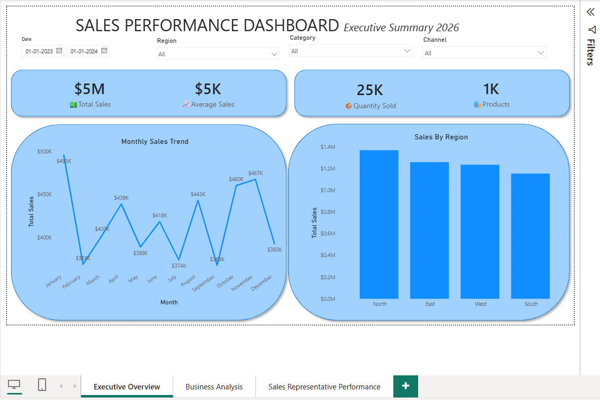
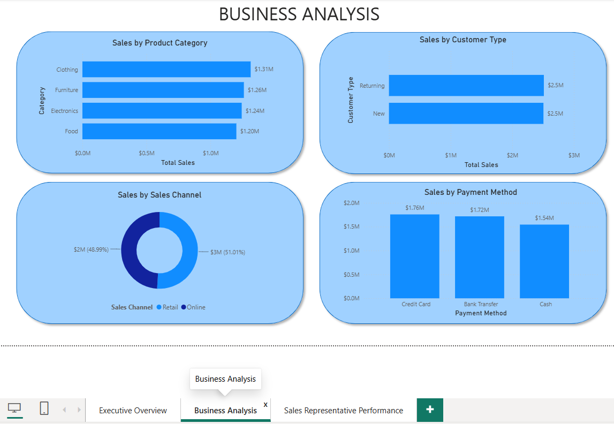
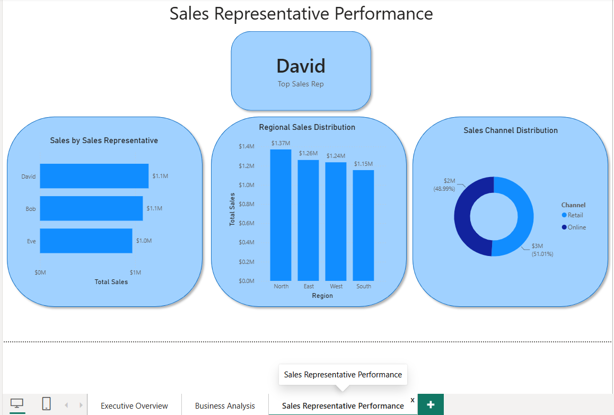

# 📊 Sales Performance Dashboard | Power BI

An interactive Sales Performance Dashboard built using **Microsoft Power BI** to analyze sales trends, regional performance, customer segments, product categories, payment methods, and sales representative performance.

---

## 📌 Project Overview

This project transforms raw sales data into an interactive business intelligence dashboard. The dashboard enables users to explore sales performance through dynamic visualizations, KPI cards, and slicers, helping stakeholders make data-driven decisions.

---

## ✨ Dashboard Features

### 📈 Executive Overview
- Total Sales
- Average Sales
- Quantity Sold
- Total Products
- Monthly Sales Trend
- Sales by Region

### 📊 Business Analysis
- Sales by Product Category
- Sales by Customer Type
- Sales by Sales Channel
- Sales by Payment Method

### 👨‍💼 Sales Representative Performance
- Top Sales Representative
- Sales by Representative
- Regional Sales Distribution
- Sales Channel Distribution

---

## 🛠️ Tools & Skills Used

- Microsoft Power BI
- Power Query
- DAX (Basic Measures)
- Data Visualization
- Data Cleaning
- Interactive Dashboard Design

---

## 📂 Dataset

The dataset contains sales transaction information, including:

- Sale Date
- Sales Amount
- Quantity Sold
- Product Category
- Region
- Sales Representative
- Customer Type
- Payment Method
- Sales Channel

---

# 🖼️ Dashboard Preview

## Executive Overview



---

## Business Analysis



---

## Sales Representative Performance



---

## 📈 Key Insights

- Sales performance can be analyzed across multiple regions.
- Product categories contribute differently to overall revenue.
- Customer type and sales channel influence sales distribution.
- Payment methods reveal customer purchasing preferences.
- Sales representative performance can be compared interactively.

---

## 📁 Repository Structure

```
sales-performance-dashboard-powerbi
│
├── Dashboard
│   └── Sales_Performance_Dashboard.pbix
│
├── Dataset
│   └── sales_data.csv
│
├── Images
│   ├── Executive_Overview.png
│   ├── Business_Analysis.png
│   └── Sales_Representative_Performance.png
│
├── README.md
└── LICENSE
```

---

## 🚀 How to Use

1. Clone or download this repository.
2. Open the `.pbix` file using Microsoft Power BI Desktop.
3. Explore the interactive dashboard using the available slicers.

---

## 👤 Author

**Prabhuvel R**

- 💼 LinkedIn: www.linkedin.com/in/prabhuvel-r

---

⭐ If you found this project useful, consider giving this repository a star.
